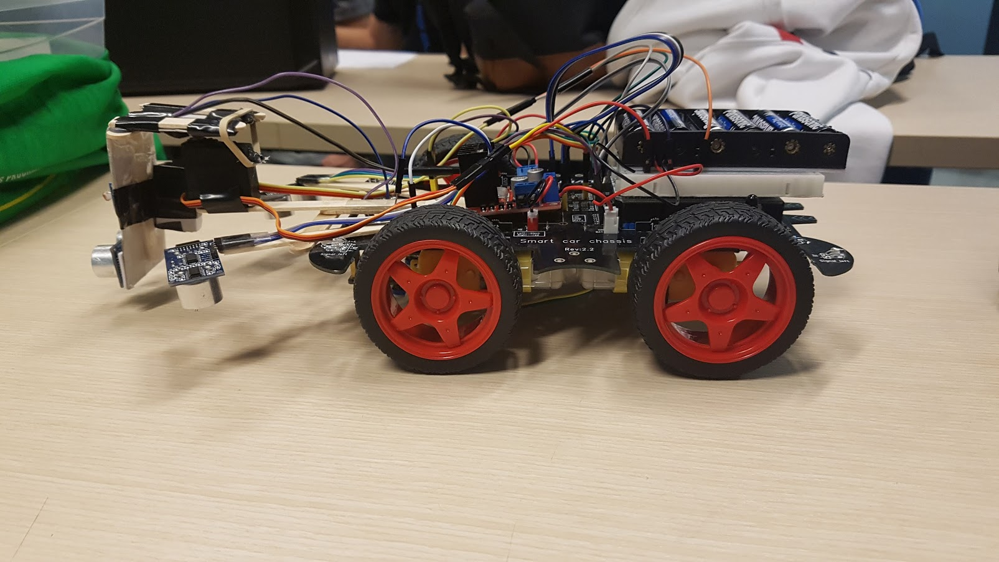

# Autonomous Robot

The Autonomous Robot can roam freely while avoiding objects / edges, follow black lines, and pick up the closest ball.

## Features

### Edge Detection

The robot uses its 2 ultrasonic modules to detect if it’s on a surface. If it senses that the left sensor is off, it goes back and turns right. If it senses that the right sensor is off, it goes back and turns left. If both sensors are off, it goes back and turns right.

### Object Avoidance

The servo motor rotates the object avoidance sensor from right to left and checks if there are any objects detected, then it rotates left if the sensor is facing the right or it rotates right otherwise.

### Line Following

If the left IR sensor detects a black line, it moves left. If the right IR sensor detects a black line, it moves right. If both detect a black line, it moves right. If neither IR sensor detects a black line, then the robot continues like normal.

### Candle Detection

The robot uses a light sensor with a photoresistor on it to detect different values of light (the lower the value, the brighter the light). Every time the servo rotates and faces a new direction, it stores the light sensor value for that direction. Once the servo completes its rotations, it compares all the stored light values to find which direction had the lowest light value (the brightest direction). When it finds the lowest light value, it turns towards that direction (left or right) and moves forward since that is the direction that is closest to the candle. When the light sensor detects a low enough value, it has found the candle and the robot completely stops all movement.

## Authors

Jonathon Bonilla

Hamzeh Jaafar
